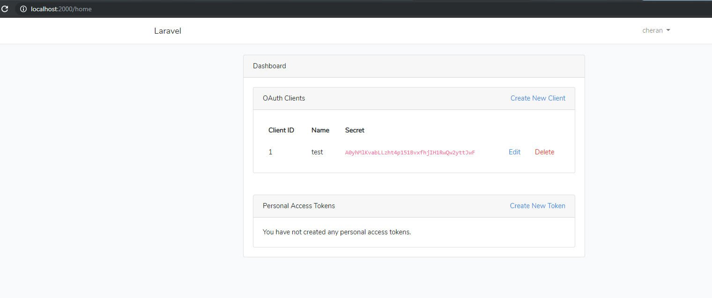
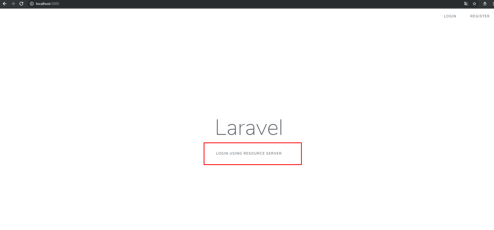
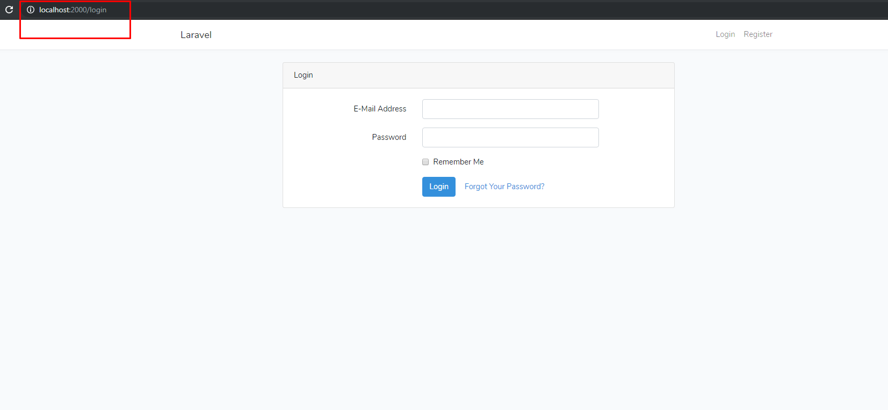
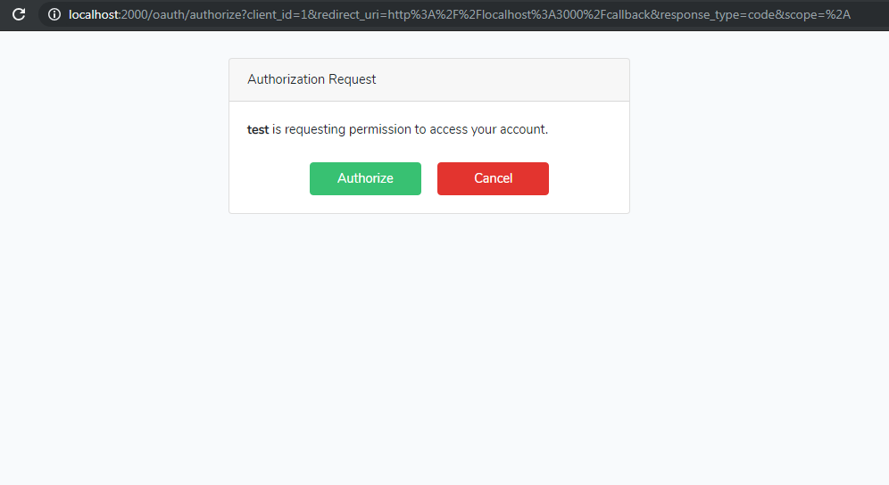
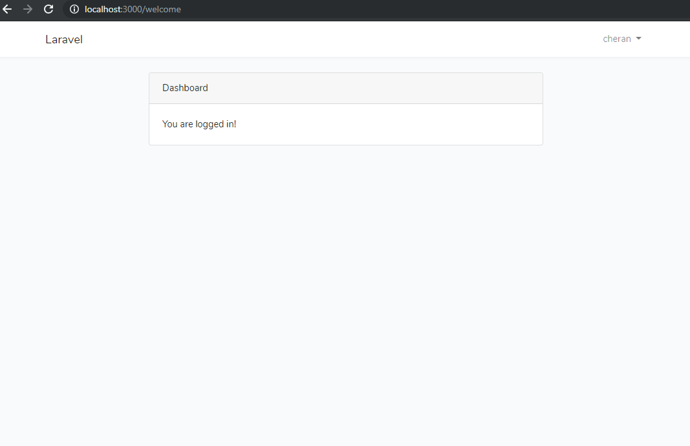

"# Laravel Passport"

## Steps

- Download the source
- Run composer install && npm install && npm run dev
- Setup .env file
- Run php artisan migrate
- Run php artisan serve --port=2000
- Create Oauth client token 

##  Create Oauth Credianals

- Dowload another laravel app(it is called as consumer app)
- Add token field in users table in consumer app
- Copy and Paste the codes in web.php which I have given below

<pre>
	use Illuminate\Http\Request;

	// First route that user visits on consumer app
	Route::get('/redirect', function () {
	    // Build the query parameter string to pass auth information to our request
	    $query = http_build_query([
	        'client_id' => 1,
	        'redirect_uri' => 'http://localhost:3000/callback',
	        'response_type' => 'code',
	        'scope' => '*'
	    ]);
	    // Redirect the user to the OAuth authorization page
	    return redirect('http://localhost:2000/oauth/authorize?' . $query);
	});

	// Route that user is forwarded back to after approving on server
	Route::get('callback', function (Request $request) {
	    $http = new GuzzleHttp\Client;

	    $response = $http->post('http://localhost:2000/oauth/token', [
	        'form_params' => [
	            'grant_type' => 'authorization_code',
	            'client_id' => 1, // from admin panel above
	            'client_secret' => 'Ys0ftKDZlAAB8riybyApoVhmpkMpYXEtd1FoVtNI', // from admin panel above
	            'redirect_uri' => 'http://localhost:3000/callback',
	            'code' => $request->code // Get code from the callback
	        ]
	    ]);
	    $token = 'Bearer '.json_decode((string) $response->getBody(), true)['access_token'];
	    if (!empty($token)) {
	        $request = $http->request('GET', 'http://localhost:2000/api/user',
	        	[
	        		'headers' => [
			        	'Accept' 	=> 'application/json',
			        	'Authorization'	=> $token
			        ]
	        ]);
	      	$user = json_decode($request->getBody()->getContents());
	      	if (!empty($user)) {
	      		// dd($token);
	          $search = \App\User::where('email',$user->email)->first();
	          if (empty($search)) {
	            $user = \App\User::create([ 
	              'name' => $user->name, 
	              'email' => $user->email, 
	              'token' => $token
	            ]);  
	          } else {
	            $user = $search;
	          }
	      		
	      		Auth::loginUsingId($user->id);
	          return redirect('welcome');
	      	}
	    	
		} 
	    // echo the access token; normally we would save this in the DB
	    return json_decode((string) $response->getBody(), true)['access_token'];
	});
</pre>

- Replace the client id and secret key from passport app
- Run consumer app in 3000 port i.e php artisan serve --port=3000
- Add this url in a href tag in welcome page  <pre>a href="{{url('redirect')}}">Login Using Resource Server</></pre>

##  Consumer App Welcome Page

- Click the button if your configuration is correct the the consumer app take you to resource(passport app) app login page

##  Passport Login Page 

- Enter the login details which is stored in passport app
- If the login details is valid it will ask the permission for Authorize

##  Ask Permission

-  Finally it will take you back to consumer app and start the session

##  Back to Consumer App

